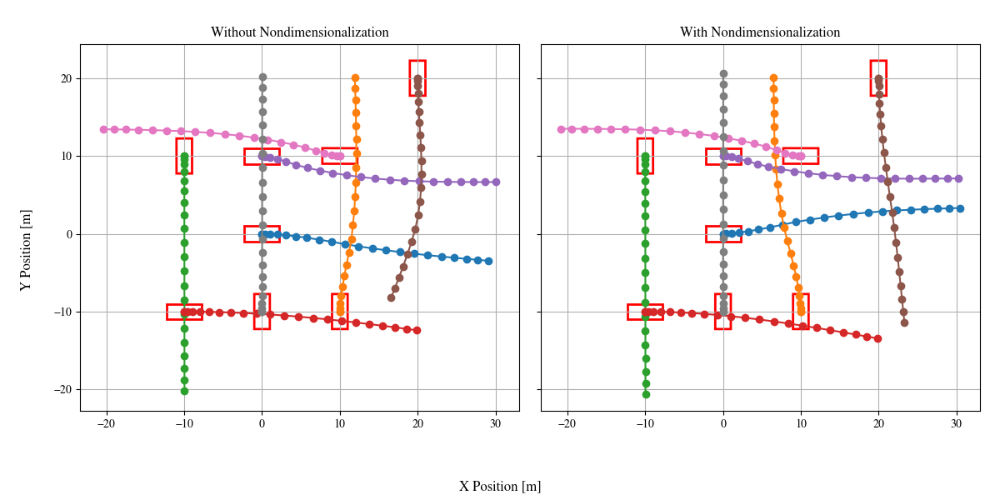

# REE-TraPla: Runtime- and Energie-Efficient Dynamic Game-Theoretic Trajectory Planner
This repository uses 
- **vectorization** to acclerate a [trajectory planner](https://github.com/giovannilucente/dynamic_game_trajectory_planner.git) based on **Generalized Nash Equilibrium (GNE)**. 
- **nondimensionalization** to reduce the pricision loss caused by reducing bit-width of data.

For further information please check the related paper accepetd by IV 2026: 

```bibtex
@INPROCEEDINGS{REE_TraPla_Xu_2026,
  author={Xu, Wenguang and Lucente, Giovanni and Membarth, Richard.},
  booktitle={2026 IEEE Intelligent Vehicles Symposium (IV)},
  title={Energy- and Runtime-Efficient Trajectory Planning via SIMD Vectorization},
  year={2026},
  organization={IEEE}
}
```

This repository contains the implementation of vectorization and nondimensionalization and a script to show the effect of the intersection scenario.

## Installation and Setup:
To install and run this project locally, follow these steps:

### 1. Clone the Repository
First, clone the repository to your local machine:
```bash
git clone git@github.com:AImotion-Bavaria/REE-TraPla.git
cd REE-TraPla
```

### 2. Initialize and submodule Recorder4Cpp
Recorder4Cpp is a helpful tool to record the data between simulation:
```bash
git submodule update --init --recursive
```

### 3. Install C++ Dependencies
```bash
sudo apt update
sudo apt install libeigen3-dev cmake g++
```
And you need ispc compiler from https://github.com/ispc/ispc.git. You may need also user's guide during customized code: https://ispc.github.io/ispc.html.


### 4. Build and Run the Project (CMake)
The main file is in /src/main.cpp. There you will find the definition of scenario for intersection. This scenario is designed to see the difference between with and without nondimensionalization. 

#### Create build folder
```bash
mkdir build
cd build
cmake ..
```
There are different configurations in CMakeLists. A sugusstion is to use ccmake to modify the configuration by
```bash
ccmake .
```
A package installation of ccmake may needed depend on your system.
There are thour configurations: 
1. **ENABLE_AARCH64**: decide if you are working on a arm or x86 processor. This is relevant to the ispc compilation
2. **ENABLE_QUANTIZATION**: use or don't use nondimensionalization.
3. **REAL_BITS**: the bit-width of data. The default is 64. Set it to 32 for measurment.
4. **USE_RECORDER**: for debug-recording. See the submodule in Recorder4Cpp.

#### Build and run:
```
cmake --build .
./dynamic_game_trajectory_planner
```
After running the program, the runtime information will be printed for the run() and integrate() function. Some information, including the trajectory points for each vehicle, are also printed in the terminal. To usee the impact of vectorization, please modify the configuration the bit-width. It's important to know that the ispc compile 64-bit double-precision automatically to 32-bit single-precision and convert them back after calculation. So if you want to compare with the real runtime of double-precision, you need switch the function manually in the function launch_integrate() from dynamic_game_planner.cpp
```
    integrate_ispc(&X_, &U_, state_ispc, M);
    // integrate(&X_, &U_); //this is the scalar version 
```
Except the runtime information, the trajectories will be recorded and saved in build folder.
To compare the effect of nondimensionalization, you need switch the configuration ENABLE_QUANTIZATION and run the program. Both data will be recorded into csv file with different name according to the configuration. So there is no worry about overwriting. To visualize the difference, run the plot script:
```
python3 ../plot_effect_nondimensionalization.py
```
If everything works, you should see the plot of the computed trajectories :

To create a new scenario to test, please refer to the main.cpp file.
